<h1 align="center">
    <span>BigHOST<br/></span>
</h1>

<p align="center">
    <br/>
    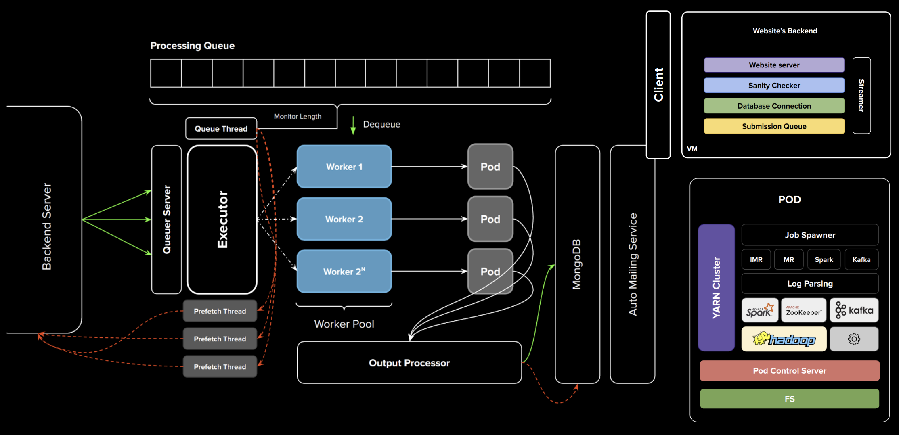</img>
    <br/>
    <br/>
    <strong>BigHOST: Automatic Assignment Grading System, CCGridW 2023</strong>
</p>

[Vishal Ramesha\*](https://github.com/iVishalr), [Sachin Shankar](https://github.com/sach-12), [Suhas Thalanki](https://github.com/thesuhas), [Supreeth Kurpad](https://github.com/supreethkurpad), [Prafullata Auradkar](https://staff.pes.edu/nm1324)

Cloud Computing and Big Data, PES University

[[Paper]](#) [[Slides]](https://docs.google.com/presentation/d/1LzbUqpLDIP-TlbKB2V_xZMHknPuKSyV9jjZk3XTBqCs/edit?usp=sharing)

BigHOST is an autograding system that is developed to evaluate Big Data Assignments. BigHOST employs a simple architecture that is scalable and provides a fair environment for executing multiple Big Data jobs in parallel.

## Table of Contents

- [Introduction](#introduction)
- [BigHOST Architecture](#bighost-architecture)
  - [Backend Server](#backend-server)
  - [Evaluation Engine](#evaluation-engine)
  - [Pods](#pods)
  - [BigHOST Distributed](#bighost-distributed)
- [Documentation](#documentation)
- [Project Setup](#project-setup)
  - [Requirements](#requirements)
  - [Setting up Environment Variables](#setting-up-environment-variables)
  - [Setting up BigHOST Configuration](#setting-up-bighost-configuration)
  - [Starting BigHOST](#starting-bighost)
    - [Backend Server](#backend-server-1)
    - [Evaluation Engine](#evaluation-engine-1)
- [Experimental Results](#experimental-results)
  - [Assignment Statistics](#assignment-statistics)
  - [Analysis on Scalability](#analysis-on-scalability)
- [Future Work](#future-work)
  - [BigHOST Peers](#bighost-peers)
  - [BigHOST Management API](#bighost-management-api)
- [Citation](#citation)
- [License](#license)

## Introduction

<p align="justify">
In this work, we present BigHOST, a system for automating evaluation of big data assignments. BigHOST consists of three components: client, backend server and evaluation engine. BigHOST is designed from the ground up to be scalable, fault tolerant and has the ability to process multiple big data jobs in parallel. BigHOST provides a fair big data environment for executing submissions through the use of docker containers. Several optimizations have been done to reduce overhead on submission’s execution, amount of network calls made to transfer submissions between systems which inturn reduces the cost of hosting the system in the cloud. BigHOST maximises the performance of a single system by processing several submissions in parallel which leads to increased throughput and lower waiting times. BigHOST was used by over 800 students in our college to test their solutions in Big Data assignments.
</p>

## BigHOST Architecture

BigHOST consists of three main components: client, backend server and evaluation engine. Client provides a web interface for users to submit submissions. Backend server acts like a queuing server where valid submissions are queued for execution. Evaluation Engine processes these submissions in parallel.

### Backend Server

<p align="center">
    <br/>
    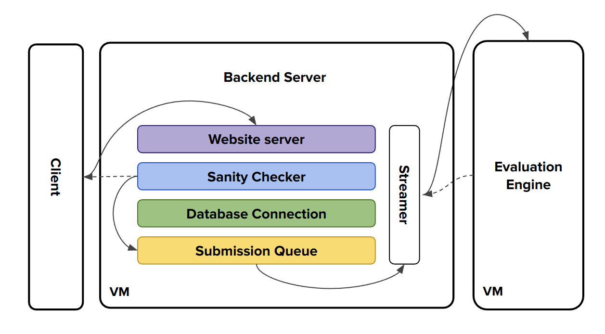</img>
    <br/>
</p>

The backend server acts as an intermediate server where submissions are stored. Backend server is responsible for validating the integrity of the submissions received and store valid syntax-free submissions in waiting queue, waiting for the submissions to be picked up by evaluation engine.

### Evaluation Engine

<p align="center">
    <br/>
    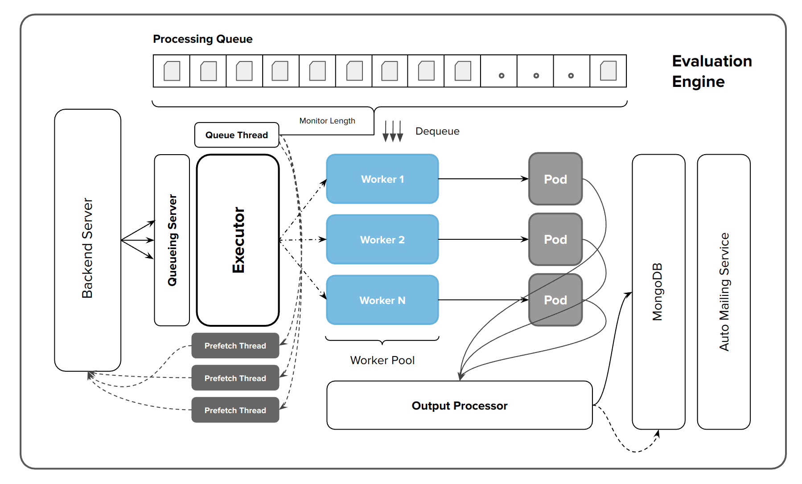</img>
    <br/>
</p>

Evaluation Engine is the main component that actually processes the submissions inside docker containers (pods). For our purpose, each pod provides a Big Data environment with support for Hadoop, Spark, Kafka jobs. Evaluation Engine is scalable both vertically and horizontally and can process multiple submissions in parallel.

### Pods

<p align="center">
    <br/>
    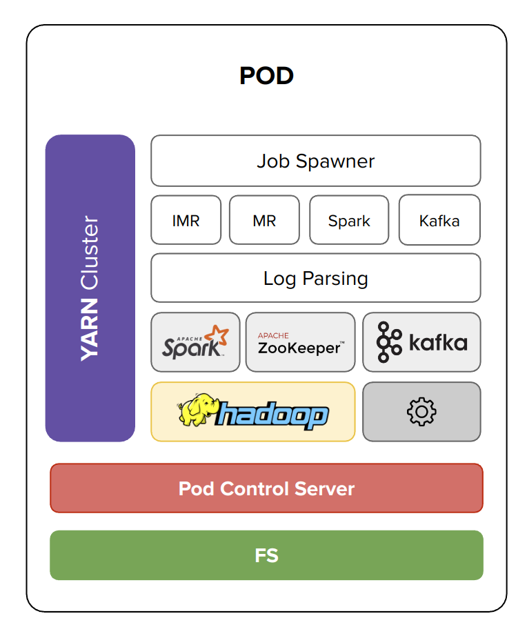</img>
    <br/>
</p>

Pods are spawned by each worker in the worker pool. Each pod can be customized according to the task at hand. For our purpose, each pod provides a Big Data environment which supports MapReduce, Iterative MapReduce, Spark and Kafka jobs. Pods can be assigned CPU and Memory limits which ensures that each submission gets the same resources for computation.

### BigHOST Distributed

<p align="center">
    <br/>
    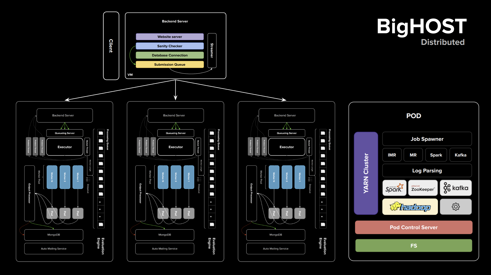</img>
    <br/>
</p>

This extends the original BigHOST architecture to work with multiple evaluation engines. Instead of using a single large instance for processing submissions, BigHOST Distributed uses mutliple small instances for processing. This approach leads to lower cloud costs and execution times per submission remains relatively constant with increase in number of containers in the entire system. This is evident from the graphs shown in [experimental results](#experimental-results).

## Documentation

For documentation, please refer to [DOCUMENTATION.md](./doc/README.md).

## Project Setup

### Requirements

The following python packages are required for running BigHOST

1. redis
2. psutil
3. Flask
4. Flask_Cors
5. python-dotenv
6. Requests
7. pymongo
8. docker_py

The python packages can be installed by using the `requirements.txt` file provided.

The following system packages are required to run BigHOST

1. Docker
2. tmux
3. vim
4. tmuxinator

Ensure that you have a proper Docker installation on your system before running the project.

[tmuxinator](https://github.com/tmuxinator/tmuxinator) is used to launch tmux session with multiple windows simultaneously.

### Setting up Environment Variables

```console
MONGO_URI_RR=<mongodb_URI>
MONGO_URI_EC=<mongodb_URI>

MAIL_USER=<email_id>
MAIL_PASSWD=<password>

BACKEND_INTERNAL_IP=<ip_address>
```

Add the above environment variables to a `.env` file in project root directory.

Replace the contents of `<...>` with the appropriate values. The IP address of backend server must be `localhost` if you are running locally else `EXTERNAL_IP_ADDR` of the backend server.

### Setting up BigHOST Configuration

The `config/evaluator.json` stores the configuration information for all components of BigHOST. Please refer to the documentation to get more details on each parameter in the configuration file. The configuration file must be setup based on the specifications of the system that BigHOST is running on. Incorrect configuration could lead to either underutilization of the system or loss of performance.

### Starting BigHOST

Assuming you have all the required packages, type the following commands in separate terminals. Note that you need to execute the commands in project's root directory.

#### Backend Server

```console
$ tmuxinator start project -n backend -p ./scripts/backend.yaml
```

#### Evaluation Engine

```console
$ tmuxinator start project -n evaluator -p ./scripts/evaluator.yaml
```

## Experimental Results

### Assignment Statistics

<p align="center">
    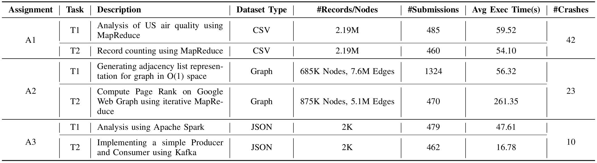</img>
    <br/>
</p>

### Analysis on Scalability

Comparison of Throughput for single node and distributed approach.

<p align="center">
    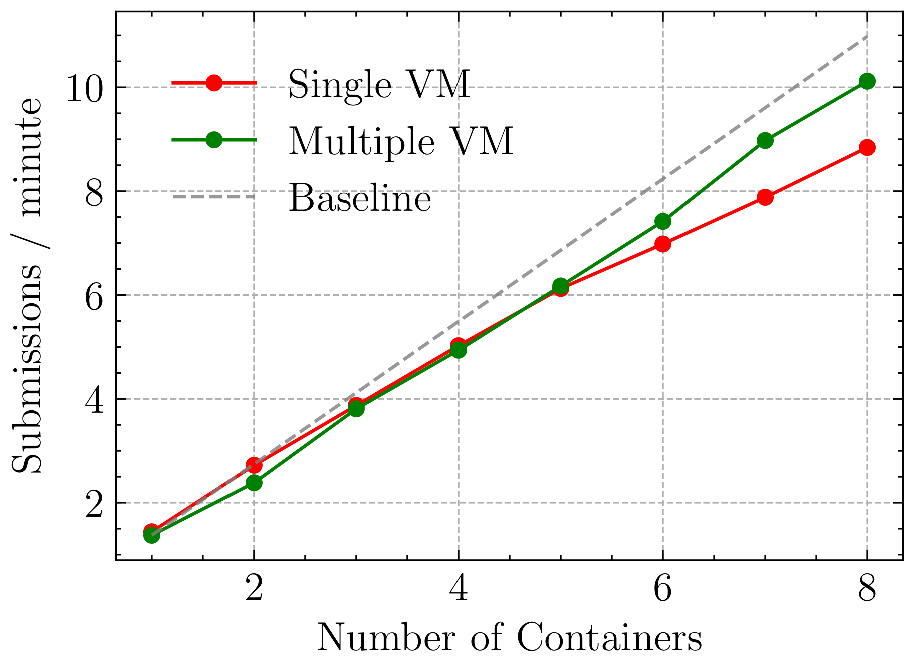</img>
    <br/>
    <br/>

</p>

Comparison of Tail latencies in execution time for single node (left) and distributed approach (right).

<p align="center">
    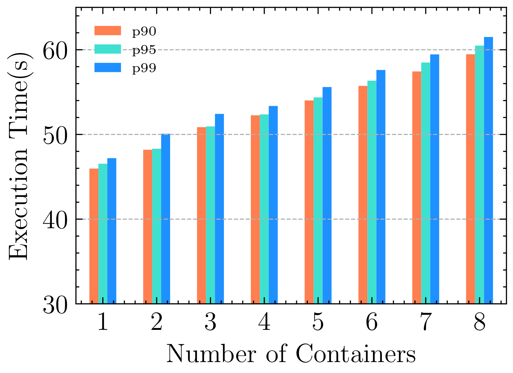</img>
    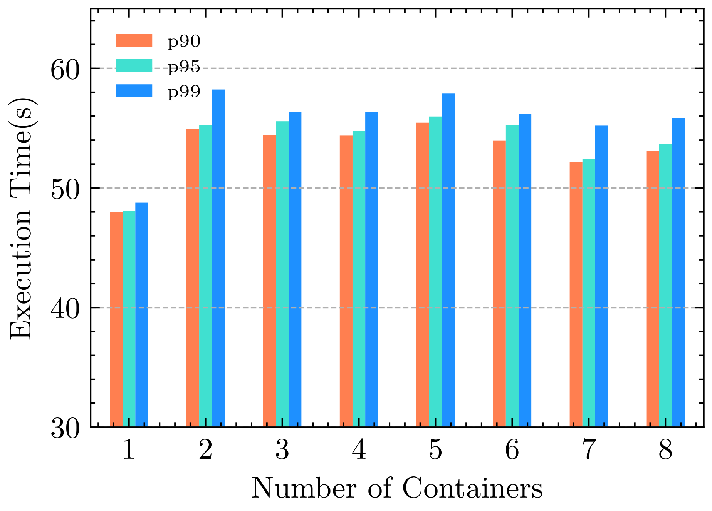</img>
    <br/>
    <br/>
</p>

Percentage increase in throughput and execution time for single node and distributed approaches.

<p align="center">
    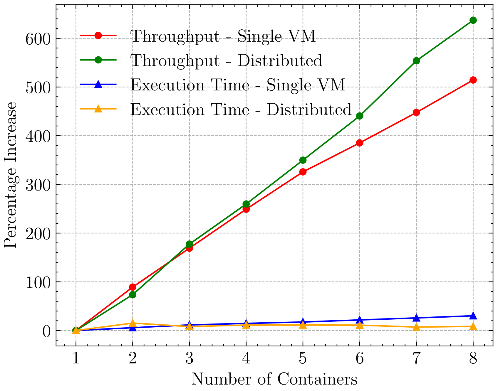</img>
    <br/>
    <br/>
</p>

## Future Work

This is a work in progress. Some of the ideas that would help BigHOST become more complete have been listed below.

### BigHOST Peers

<p align="center">
    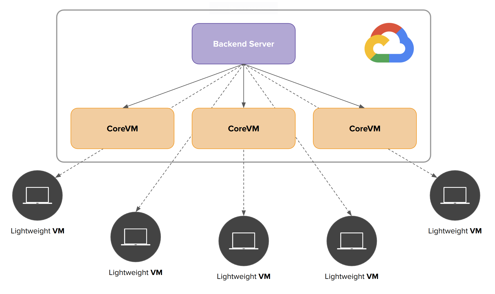</img>
    <br/>
</p>

<p align="justify">
This extends the BigHOST architecture to support computing devices that are outside BigHOST system. Users can attach their computers to the BigHOST system and process jobs or submissions. This provides more compute devices for horizontal scaling. BigHOST now treats each computing device as either CoreVM or LightweightVM. CoreVMs are virtual machines that have high compute resources and these VMs are deployed on cloud and are part of BigHOST system. LightweightVMs are user virtual machines that run BigHOST software and are attached externally to BigHOST system. BigHOST backend server keeps track of every evaluation engine currently attached to the system. BigHOST backend server sends submissions to the VMs depending on whether it's a CoreVM or LightweightVM. CoreVMs gets more submissions to process due to high compute resources compared to LightweightVMs that get lesser submissions to process. BigHOST controls this by tweaking the configuration file provided for each VM type.
</p>

### BigHOST Management API

BigHOST Management API provides a simple way to retreive different logs from all executors currently attached to the system. Each evaluation engine periodically sends worker logs, system resource utilization logs, and latency logs to the backend server. Backend server opens few routes through which these information can be accessed.

`executors/` - This endpoint provides details on all the executors that are attached to the system. Additionally, it also provides the details about each evaluation engine and the configuration of the same.

```console
{
    "127.0.0.1": {
        "cpu_limit":6,
        "executor_log_dir":"/home/vishalr/Desktop/backend-2022/executor-logs/",
        "executor_name":"Assignment2",
        "executor_uuid":"c4854995-4cca-4159-ac74-09859aea96d2",
        "ipaddr":"127.0.0.1",
        "mem_limit":"8000m",
        "num_backends":2,
        "num_prefetch_threads":2,
        "num_threads":2,
        "num_workers":1,
        "prefetch_factor":4,
        "sys_info":{
            "architecture":"x86_64",
            "hostname":"pop-os",
            "ip-address":"127.0.1.1",
            "mac-address":"18:c0:4d:61:8c:33",
            "platform":"Linux",
            "platform-release":"6.0.12-76060006-generic",
            "platform-version":"#202212290932~1673966427~22.04~e15d5b5 SMP PREEMPT_DYNAMIC Tue J","processor":"x86_64",
            "ram":"16 GB"
        },
        "threshold":8,
        "timeout":30
    }
}
```

`logs/` - This endpoint returns all the logs collected from all the executors attached to the system.

```console
{
    "logs": {
        "127.0.0.1": {
            "output_processor_logs.txt": ...,
            "sys_logs.txt": ...,
            "worker1_logs.txt": ...,
        }
    }
}
```

These information can be used to build a dashboard where we could display information about each evaluation engine and it's current status. Other routes can also be added as necessary.

## Citation

This work has been accepted at _2023 IEEE/ACM 23rd International Symposium on Cluster, Cloud and Internet Computing Workshops (CCGridW)_.

Official BibTeX citation will be updated once available.

## License

MIT
