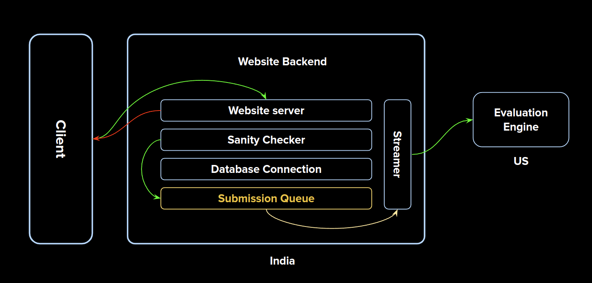
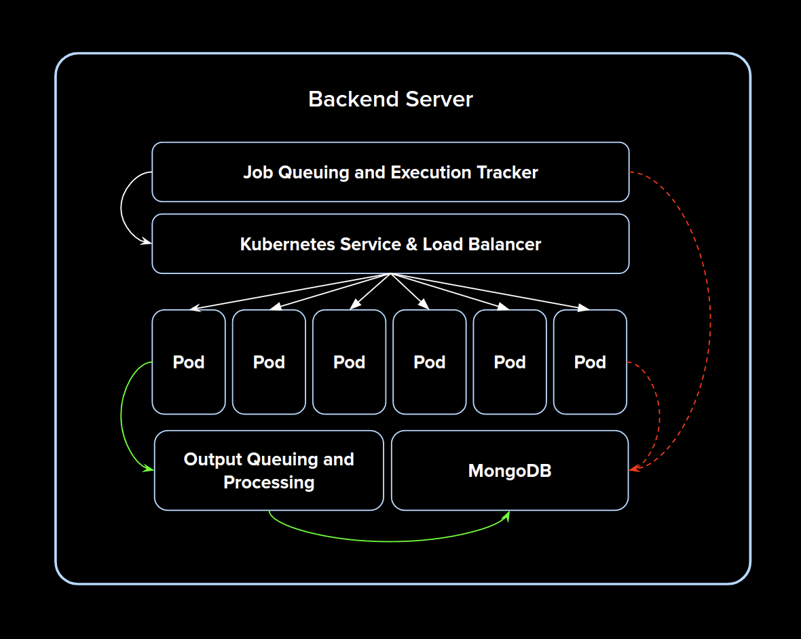

# Big Data Backend Engine

This project is currently under development.

## Backend Architecture

Let's try to keep the architecture as simple as possible while still maintaining scalability and efficiency. The backend of the entire portal will consists of two parts. One for the website and the second for our evaluation engine.

#### Website's Backend Config

1. VM with atleast 8 core cpu and 16gb ram.
2. 100 GB disk space.
3. Deployed in India to provide low latencies to students.

#### Evaluation Engine Config

1. VM with atleast 16 cores cpu and 64gb ram.
2. 200 GB disk space (disk is cheap).
3. Deployed in USA to minimize network and VM costs.

Both the Website's backend and evaluation engine will communicate with each other over network.

## Details on Web portal

<p align="center" padding="100px">
    </img>
</p>

The webportal will consist of a frontend and a backend. The backend will be used for serving the client requests. The backend will also communicate with the evaluation engine. The website backend will also maintain a direct connection to the MongoDB instance that's running in evaluation server.

The basic functionalities supported would be the following :

1. Students will be able to login to their respective accounts.
2. Students can change their login credentials.
3. Students can upload their scripts for evaluation.
4. Students can check the status of their submission.
5. Students can check the queue waiting time.

#### Performing initial sanity checks

When the students upload their scripts, we will perform a sanity check by compiling the scripts to check for any syntax errors and illegal modules. Only the scripts that passes this sanity check will be queued for evaluation. Scripts that do not pass the check will be terminated and an update in the database will be made to let them know their submission status. (This is where a direct connection to database from website's backend is helpful.)

The submission will be queued on the website's backend itself. This will prevent us from losing all the submissions if the evaluation engine crashes.

Instead of using RabbitMQ or Redis for queuing the submissions, I suggest we use a simple queue mechanism. One main reason I believe this idea is good is because since we are running the servers in India and US, the submissions must be transfered to US server and this network transfer will take time. So to overcome this delay we will need to prefetch submissions from India server and queue them on US server. Note that this second queue will be very small, only holding 8-16 submissions depending on the number of pods we run. While submissions are being processed in the pods, the next batch of submissions will be made ready by prefeteching it.

Implementing our own queue will also help is in finding the total wait time, finding the position of a submission in the queue and so much more.

##### How do we stream the submissions to US server?

So when the queue in US server becomes empty, the US server will send a request to the India server asking for more submissions. The India server will then create the payload of 'x' submissions and make a post request to a route on US server.

In python this can be done using the `requests` module. In javascript we should be able to use `axios` to achieve this.

## Details on Evaluation Engine

The evaluation engine is where the magic happens. We will be using Kubernetes and Docker containers to make the evaluation engine fault tolerant. This will help us prevent downtime and also helps us to process multiple submissions at once in parallel. The following figure shows the rough architecture of the backend.

<p align="center" padding="100px">
    </img>
</p>

#### Job Queuing and Execution Tracker

As said earlier, we need to stream the submission files to US server where our evaluation engine will be running.

The batch of submissions sent from India will be queued here. When the pods are done with their previous batch, the batches in the queue will be passed to the pods for processing.

Execution Tracker is need to maintain a log of which submission is running on which pod. This is mainly done for extra safety. If a submission manages to crash a pod, this log will help us in determining which submission crashed the pod. Thus blacklisting will be made easier. If a submission crashes the pod, an update in MongoDB will be made. (red dashed arrow.)

#### Kubernetes Service & Load Balancer

We will be using kubernetes to orchestrate our containers. Kubernetes comes with automatic pod restarting and load balancing. This will be very useful to us to automatically restart the pods without manual intervention. Kubernetes also allows replicasets meaning we can have multiple instances of a docker container. The load balancer will evenly distribute the load to the pods. Hence we can now process submissions in parallel.

#### Pods

Each pod will have a Hadoop runtime env setup inside them. This is done by using a custome hadoop docker image. A flask server will be running inside each pod. This server will receive the submission from the above services and put the submission to execution.

##### How do we check if a submission exceeds alloted time.

To do this, the flask server will spawn a child thread alongside the main process. This thread will track the execution time of the main process. Should submission exceed the alloted time, the child process will issue a SIGTERM to kill the process groups.

An update in the database will be made to let the student know that their submission has timed out.

#### Output Queuing and Processing

Once the submission has been processed by the pod, the output files will be copied and will be sent here. We will then compare the student's output with ours and then compute the marks. The marks will then be updated in the database.

##### Why do we need to do this separately?

This needs to be separated from pods because comparision of output is relatively less computationally intensive and hence we do not want to waste pod's time in computing this. Let the pods move onto the next submission and let the output processor handle comparing outputs.

##### Why do we need another queue?

We need another queue because we have multiple pods running and each one of them can send a request to the output processor to compare the output. If all of them send at once, we need a mechanism to store the submissions somewhere and hence the queue. The size of this queue, on average, will be equal to the number of pods we are running.

#### MongoDB

To store everything :)

## Build Steps

To build image, type the following in terminal

```bash
cd docker
docker build -t hadoop-3.2.2:0.1 -f hadoop3.dockerfile .
cd ..
```

To run the image, type the following in terminal

```bash
docker run -p 8088:8088 -p 9870:9870 -p 10000:10000 -p 19888:19888 --name hadoop-3.2.2-container -d hadoop-3.2.2:0.1
```

To stop and remove the container, type the following in terminal

```bash
docker stop $(docker ps -a -q) && docker rm $(docker ps -a -q)
```

To run a MR Job follow the steps given below (no longer relevant)

1. Build Image
2. Run the image in docker container
3. Wait atleast 20 seconds while the docker container finishes setting up hadoop env.
4. Verify if flask server is running on port 10000 by typing the following command `docker logs hadoop-3.2.2-container`.
5. Once the flask server is running, in another terminal window type `python3 ./client.py`

## Running a Evaluation Simulation

Note : You should be in project root directory

#### Setting up Hadoop

```bash
docker stop hadoop-3.2.2-container
docker rm hadoop-3.2.2-container
docker run -p 8088:8088 -p 9870:9870 -p 10000:10000 -p 19888:19888 -v $PWD/output:/output --name hadoop-3.2.2-container -d hadoop-3.2.2:0.1
```

#### Setting up Redis

```bash
docker stop redis-stack-server
docker rm redis-stack-server
docker run -d --name redis-stack-server -p 6379:6379 redis/redis-stack-server:latest
```

#### Job Queuer

In a new terminal type the following

```bash
gunicorn -w 2 --preload --timeout 90 --bind 127.0.0.1:10001 "job_tracker.queuer:app"
```

#### Website's Backend

In a new terminal type the following

```bash
gunicorn -w 2 --preload --timeout 90 --bind 127.0.0.1:9000 "test.backend:app"
```

#### Queue some submissions

To simulate queueing 120 submissions and retreiving one submission, in a new terminal type

```bash
python3 ./client.py
```

#### Checking queue lengths through browser

Now the we have queued the submissions on website's backend, go to browser and make a GET request to the following routes

```
http://localhost:9000/queue-length
http://localhost:10001/queue-length
```

<!-- Now we will have 119 submission on website's backend and 1 submission in evaluation engine's backend. -->

#### Start Executing submissions

Time to execute these submissions. In a new terminal, type

```bash
python3 -m job_tracker.executor
```

This will start executing the jobs on docker container.

Please do not change any configuration in Executor file! Currently there are few issues which needs to be taken care of but, it executes properly.

#### Clear the queues

To clear the queues, in browser make GET requests to

```
http://localhost:9000/empty-queue
http://localhost:10001/empty-queue
```

## Ports Used

1. 10000 - Port that flask server in docker container is running. This port receives all the request for job processing
2. 9870 - HDFS Datanode WebUI
3. 8088 - Hadoop Resource Manager UI
4. 10001 - Job Queuer and Tracker Flask server
5. 9000 - Website's backend flask server
6. 6379 - Redis Docker Container
7. 19888 - JobHistoryServer

These ports can change in future.
