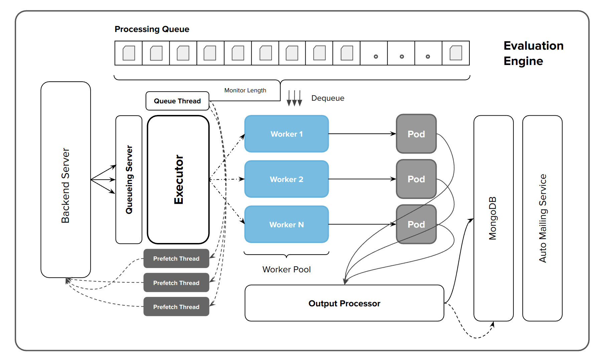
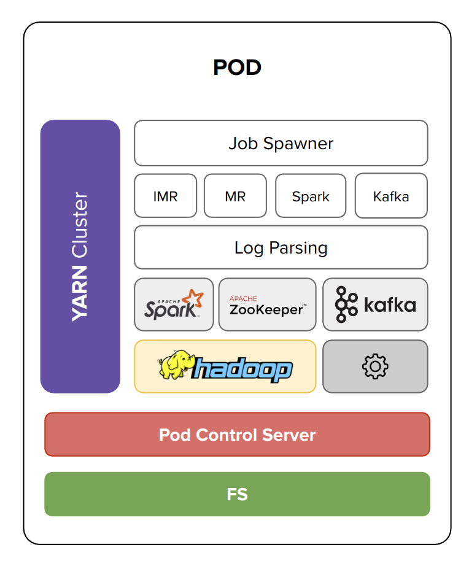
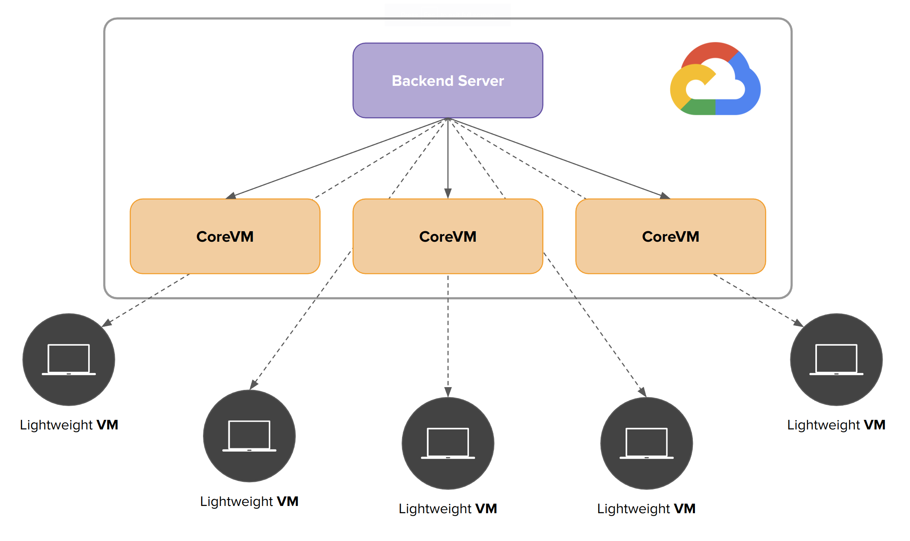

<h1 align="center">
    BigHOST Documentation
</h1>

This documentation provides a brief overview on how BigHOST works and the purpose of different components in the system.

<h2>Table of Contents</h2>

- [High Level Design](#high-level-design)
- [Low Level Design](#low-level-design)
  - [Backend Server](#backend-server)
    - [Website Server](#website-server)
    - [Sanity Checker](#sanity-checker)
    - [Responsibilites](#responsibilites)
  - [Evaluation Engine](#evaluation-engine)
    - [Executor](#executor)
    - [Worker Pool](#worker-pool)
    - [Pods](#pods)
    - [Output Processor \& Auto Emailiong Service](#output-processor--auto-emailiong-service)
- [Fault Tolerance](#fault-tolerance)
- [Scalability](#scalability)
- [BigHOST Environment File](#bighost-environment-file)
- [BigHOST Configuration File](#bighost-configuration-file)
- [BigHOST Distributed](#bighost-distributed)
- [BigHOST Logging](#bighost-logging)
- [BigHOST Jobs](#bighost-jobs)
- [BigHOST Management API](#bighost-management-api)
- [BigHOST Peers](#bighost-peers)
- [Project Requirements](#project-requirements)
  - [Downloading System Packages](#downloading-system-packages)
  - [Installing Docker](#installing-docker)
- [Building Docker Images](#building-docker-images)
- [Running BigHOST](#running-bighost)
  - [Starting BigHOST](#starting-bighost)
    - [Backend Server](#backend-server-1)
    - [Evaluation Engine](#evaluation-engine-1)
  - [Attaching to Tmux Sessions](#attaching-to-tmux-sessions)
  - [Switching Tmux terminals](#switching-tmux-terminals)
  - [Detaching from Tmux](#detaching-from-tmux)
- [Deploying on Google Cloud Platform (GCP)](#deploying-on-google-cloud-platform-gcp)
  - [System Requirements](#system-requirements)
    - [Backend Server](#backend-server-2)
    - [Evaluation Engine](#evaluation-engine-2)
  - [Instructions for Deployment on GCP](#instructions-for-deployment-on-gcp)

## High Level Design

<p align="center">
    <br/>
    </img>
    <br/>
</p>

BigHOST consists of three main components: client, backend server and the evaluation engine. Client provides a web interface which the users can use to submit their submissions to the system for evaluation. The backend server acts as an intermediary server. The backend server accepts submissions from the client, performs various checks on the submission to ensure that the submission is safe to be processed. Submissions that do not pass these checks will be reject and will not be processed. The backend server then stores the valid submissions in a waiting queue, waiting to be picked up by the Evaluation Engine. The evaluation engine is the one that actually processes the submissions. Evaluation Engine provides a Big Data environment where submissions can be executed in isolation. After the submission is processed, the status of the submission will be notified by a mailing service and will be updated in the mongoDB.

## Low Level Design

### Backend Server

This section provides more details on the workings of different components in the backend server.

#### Website Server

The website server is a simple Flask server that is responsible for accepting submissions from the client. This server is deployed using Gunicorn to make the server be capable of accepting simultaneous connections.

On receiving a submission, the website server extracts different metadata from the request along with the code solutions. The metadata and code is then transformed into a Job class. This job class contains all the necessary info about a particular submission. The job class gets propagated through the entire pipeline until the submission gets completely processed.

#### Sanity Checker

First step after receiving the submission is to perform Sanity check on the submission. This module checks if the submission is safe to be executed. It also performs various checks such as ensuring code integrity, illegal module imports, and much more. Submissions that pass the sanity check will be queued in a waiting queue. Submissions that do not pass the sanity check will be rejected immediately and the reason for rejection will be notified to the user.

#### Responsibilites

The backend server is also responsible for maintaining a record of all the evaluation engines that are currently attached to the system. It also receives all the logs generated by each evaluation engine and stores them on disk.

The backend server also provides a Management API through which we can get a list of executors that are currently attached along with the specifications and configuration that each evaluation engine is running. The management API also provides an easy way to get access to all the logs that are generated by all the evaluators. This prevents from us going to each evaluator and collecting the logs manually.

### Evaluation Engine

<p align="center">
    <br/>
    </img>
    <br/>
</p>

Evaluation engine is responsible for processing the submissions. Evaluation engine is designed to be scalable and fault tolerant. Evaluation engine provides a fair Big Data environment for executing submissions. Evaluation engine is capable of processing mutliple jobs in parallel in isolation.

Each evaluation engine consists of several components: executor, a worker pool, docker containers, an output processor, a processing queue and auto mailing service. Each component plays a specific role in the evaluation engine, allowing it to be scalable, fault-tolerant and easier to maintain.

#### Executor

This is the main component of the evaluation engine that is responsible for managing all the other components in the system. On startup, the executor spawns several worker processes and certain background threads for monitoring the queue length and fetching additional submissions.

The submissions are fetched from the backend server and are queued in the processing queue. The queue thread, spawned by the executor, periodically monitors the length of the queue. When the length of the processing queue falls below a threshold T, the queue thread will then spawn threads called the prefetch threads that fetch additional submissions from the backend server for processing.

#### Worker Pool

Worker pool consists of processes called workers that are spawned by the executor. Each worker in the worker pool is assigned a rank by the executor. This rank is used for identifying the worker in the worker pool. The worker processes are responsible for dequeuing submissions from the processing queue and putting the submission to execution.

On startup, each of the worker processes in the pool will start a docker container (also called as pods) and will assign the worker's rank to the container for identification. The submissions dequeued by the worker processes will be sent to the worker's container and will be executed inside the container. While a submission is being executed in a pod, the worker processes perform several bookkeeping tasks such as handling submission's metadata, keeping track of elapsed time of execution for a submission, killing submissions that exceed time limits, and crash recovery when the submission in execution crashes a container.

Each worker process uses a stop-and-wait protocol. Each worker dequeues submission from the processing queue, sends it to the pod for processing. The worker then waits until it gets a response from the pod before moving to the next submission in the processing queue. This mechanism implicitly performs load balancing of submissions across all the workers in the worker pool. This eliminates the need for a explicit load balancer and reduces overheads.

Each worker in the worker pool periodically checks the processing queue for submissions to execute. An exponential backoff for worker processes is used when there are no submissions in the queue. Workers increase their timeout exponetially up to a configured limit. When a submission gets enqueued, the worker that checks the queue next will dequeue that submission and reset its timeout.

When the rate of arrival of submissions matches the time taken for executing a submission, the worker that processed the previous submission will continue to process the new submission, while other workers keep increasing their timeout. This results in one of the workers processing more submissions compared to others leading to become a hot worker. The advantage with such an approach is that the respone time reduce as the submission will be picked up at a much faster rate. When the rate of arrival of submission increases, other workers pick up the submission for execution and the system eventually becomes auto-load balancing.

#### Pods

<p align="center">
    <br/>
    </img>
    <br/>
</p>

These are docker containers that are spawned by a worker process in the worker pool. The pods provide a fair execution environment for executing a submission. The pods can be easily configured depending on the type of job that needs to be executed. For our purpose, each pod provides a big data environment consisting of Hadoop, Spark and Apache Kafka.

Each container has a HTTP server called the Pod Control Server. This server provides an API through which the worker processes can submit submissions to the container for execution. The Job Spawner module inspects the metadata in the submission and starts the appropriate big data job.

The different types of jobs include MapReduce, Iterative MapReduce, Spark and Kafka jobs. Hadoop and Spark jobs are configured to be executed on YARN cluster running inside each pod. This allows us to make use of the job tracking and monitoring functionalities that YARN uses for tracking the status of submissions. The Log Parsing module is used to collect all the stdout and stderr messages of a submission.

The idea of using a container for executing submissions is that each submission can be assigned a specific CPU, memory and time limits for execution. It also helps in executing the submission in isolation. Fault tolerance is achieved by restarting the container when a container crashes due to excess memory usage by the submission.

#### Output Processor & Auto Emailiong Service

Output processor is used for checking the output of submissions with the answer key efficiently. This increases throughput of the evaluation engine as outputs are processed and compared independently in parallel and the worker could move to the next submission while the output of previous submission is being checked.

Auto emailing service is used to automatically send out mails to users indicating the status of their submissions.

## Fault Tolerance

<p align="center">
    <br/>
    </img>
    <br/>
</p>

The need for implementing fault tolerance in the evaluation engine arises from the fact that submissions running inside the containers can crash the containers during execution by consuming excess memory. It is essential that the system is designed to be fault-tolerant to handle these scenarios, making the system more reliable and available. Two methods that can be used to prevent containers from crashing are: using a monitoring service that periodically checks the health of the containers, or allowing the containers to crash and recovering from the crash. We use the latter approach to implement fault tolerance in the evaluation engine because the former approach adds a lot of overhead to the submission's runtime as it requires continuous monitoring of the container's health. Instead, the evaluation engine allows the containers to crash and worker processes are notified when a crash occurs. More specifically, each worker process maintains a TCP connection with the HTTP server running inside the pod. The worker uses this connection for passing the submission to the pod for execution and for receiving response messages from the pod. If a submission creashes the container, the TCP connection gets interrupted. The worker process catches this interrupt signal and recovers from the crash by restarting the container and moves to the next submission in the queue. To handle submissions that go into infinite loops, a timeout is attached to the TCP connection. If a submission takes longer than the configured timeout, the submission is killed inside the container and the connection closes. The worker process then moves on to processing the next submission in the queue.

## Scalability

The evaluation engine is mainly designed to be vertically scalable. However, the evaluation engine can be configured to run on multiple instances, each consuming submissions from the backend server. The system can be scaled both vertically and horizontally. Scaling vertically corresponds to adding more containers per instance. Horizontal scaling is achieved by adding additional evaluation engines to the system on different machines.

Each pod is assigned a certain amount of CPU time and a certain amount of memory. This ensures that all the submissions are executed with the same amount of resourcesm which makes the time taken by identical submissions for execution similar.

Several techniques, such as load balancing, prefetching submissions, minimizing network calls, and the notion of hot workers, have been used to minimize the response time and network cost per submission.

Submission prefetching is done to amortize the cost of fetching submissions. When the proccessing queue length goes below the threshold T, the queue thread spawns threads that request the backend server to send additional submissions to the evaluation engine. This ensures that there is always certain amount of submissions in the processing queue which prevents the worker from waiting for a submission to arrive. Another optimization that the evaluation engine does is that instead of each prefetch thread fetching only one submission per network call, it configures the prefetch threads to fetch mroe submissions per call. This is controlled by `preftech_factor` option that denotes the number of submissions to fetch per network call. This minimizes TCP's 3-way handshake overhead per submission.

## BigHOST Environment File

The BigHOST environment file contains sensitive information that cannot be exposed to public. This includes the URI of MongoDB, mail user and passwords for the same and the IP_ADDR of the backend server.

```console
MONGO_URI_RR=<mongodb_URI>
MONGO_URI_EC=<mongodb_URI>

MAIL_USER=<email_id>
MAIL_PASSWD=<password>

BACKEND_INTERNAL_IP=<ip_address>
```

Replace the contents of <...> with appropriate values.

Set `BACKEND_INTERNAL_IP` to be `localhost` if you are running locally else `BACKEND_INTERNAL_IP` should be set to the `EXTERNAL_IP` of the machine in which backend server is running on.

## BigHOST Configuration File

BigHOST is designed to be easily configurable to suit the task at hand. BigHOST configuration file includes many configuration options. It is important to understand the effect of changing configurations. This will help you maximize the performance of BigHOST. Misconfiguring BigHOST could lead to loss of performance in terms of number of submissions processed and the total latency per submission or it could lead to under utilization of system resources there by not being able to process more submissions.

The various configuration options are listed below.

```json
{
	"backend": {
		"name": "backend",
		"log_dir": "/home/vishalr/Desktop/backend-2022/logs/",
		"config_dir": "/home/vishalr/Desktop/backend-2022/configs/"
	},

	"executor": {
		"name": "Assignment2",
		"num_backends": 2,
		"num_workers": 1,
		"fetch_port": 9000,
		"fetch_route": "get-jobs",
		"prefetch_factor": 4,
		"prefetch_threads": 2,
		"threshold": 8,
		"global_queue_thread": true,
		"global_prefetch_thread": true,
		"timeout": 30,
		"log_dir": "/home/vishalr/Desktop/backend-2022/executor-logs/",
		"log_timeout": 120,
		"sys_timeout": 1,
		"output_processor_threads": 1,
		"output_processor_timeout": 30,
		"store_lats": true,
		"lats_dir": "/home/vishalr/Desktop/backend-2022/lats/"
	},

	"docker": {
		"docker_ip": "localhost",
		"docker_port": 10000,
		"docker_route": "run_job",
		"docker_image": "hadoop-3.2.2:0.1",
		"cpu_limit": 6,
		"taskset": true,
		"memory_limit": "8000m",
		"shared_output_dir": "/home/vishalr/Desktop/backend-2022/output/",
		"docker_output_dir": "/output",
		"docker_memswapiness": 0,
		"spawn_wait": 40,
		"blacklist_threshold": 5,
		"blacklist_duration": 120
	}
}
```

The configuration file is present in `config/evaluator.json` file. The config file is divided into three sections: backend, executor and docker.

<strong>Backend Configurations</strong>

`name` - Give a name to your backend server.

`log_dir` - Directory in which backend server stores all the logs generated by the backend server as well as the logs sent by all evaluators in the system.

`config_dir` - Directory in which the backend server will store the configuration that each evaluator in the system is currently running.

<strong>Executor Configurations</strong>

`name` - Give a name to your Evaluation Engine.

`num_backends` - Number of Pods you want to run in the evaluation engine.

`num_workers` - Number of worker process to spawn in the worker pool. This parameter is linked with the `num_backends` parameter. Number of backends per worker is calculated as `num_backends // num_workers`. It is essential to make sure that `num_backends` is divisible by `num_workers`.

`fetch_port` - Port on backend machine where the server responsible for sending submissions (aka backend server) is running.

`fetch_route` - Route on the backend server that is responsible for sending submissions on request.

Note: Executor will make a request to `http://BACKEND_INTERNAL_IP:fetch_port/fetch_route` to obtain submissions from backend server.

`prefetch_factor` - Specifies the number of submissions to fetch per request to the backend server.

`prefetch_threads` - Specifies the number of threads that will simultaneously make a request to the backend server to request for additional submissions.

Note: Total number of submission recevied will be atmost `prefetch_threads x prefetch_factor`, when sufficient submissions are queued up in the backend server, else the prefetch_threads will retreive how many ever submissions exists on backend server.

`threshold` - Specifies the processing queue length threshold T. If number of submissions in the queue goes below the threshold T, the queue_thread will spawn the prefetch_threads to fetch additional submissions. It is important to set threshold such that there always exists a few submissions in the queue such that the pods running in workers do not have to wait for submissions to arrive (this should be the case when backend server has plenty of submissions queued). If backend server does not have submissions waiting to be picked up by the evaluator, then no submission will be sent.

`global_queue_thread` & `global_prefetch_thread` are dummy params. Set it to TRUE by default.

`timeout` - Specifies the upper limit (in seconds) for increasing exponential backoff for workers, queue_thread, output_processor. When there's nothing to process, each worker increases its timeout exponentially and this timeout specifies that upper limit. This is an important parameter as well as it directly controls the responsiveness of BigHOST. Setting to a low timeout would lead to system being highly responsive and setting to a high timeout would lead to system being less responsive. The timeout must be set based on the task at hand. If your tasks take less time to process and rate of arrival of new submissions are high then having a low timeout is ideal.

`log_dir` - Directory in which the evaluation engine will store the logs generated.

`log_timeout` - Specifies a timeout for the log thread. Log thread is responsible for sending the logs generated by the evaluation engine to the backend server. Log thread sends logs to backend server every `log_timeout` seconds.

`sys_timeout` - Specifies a timeout for the sys thread. Sys thread records the CPU, Memory and Swap utilization every `sys_timeout` seconds. The sys logs generated will be sent to the backend server by the log thread.

`output_processor_threads` - Specifies the number of threads to use in the output processor. Generally a single thread is enough to process outputs of all submissions.

`output_processor_timeout` - Specifies a timeout for the output processor. Effect of this parameter is the same as `timeout` parameter. Generally its good to set this parameter equal to `timeout` parameter.

`store_lats` - (true/false) Tells output processor if it needs to store the latency information of each submissions in `lats_dir`.

`lats_dir` - Directory in which the output processor shall store the latency information related to each submission. Format of storage - `assignmentId_submissionId.json`.

<strong>Pod or Docker Configurations</strong>

`docker_ip` - Specify the IP_ADDR of the container spawned by the worker process. By default its `localhost`.

`docker_port` - Specify the port inside the container in which the Pod Control Server runs. This port refers to a port inside the container and not host port. The host port is assigned randomly when the worker process spawns the container.

`docker_route` - Specify the route in the Pod Control Server that is responsible for accepting jobs from the worker process.

`docker_image` - Specify the image name along with tag. This is used by worker process to start the correct build of docker containers.

`cpu_limit` - Specify the CPU limit to be used for each container.

`taskset` - Specify true/false. Taskset will override the default docker container scheduler and pins the containers to specific CPU cores of size `cpu_limit` (eg. 0 - 0\*cpu_limit+cpu_limit, cpu_limit+1 - (1\*cpu_limit+cpu_limit), ...). Note that if the system does not have enough CPU cores to accomodate all the pods with the specified cpu_limit, the worker will override this parameter and set it to false.

`memory_limit` - Specify the amount of memory to use in megabytes. Format "1000m" or "2000m". Allocates 1GB or 2GB of memory to each container in the system.

`shared_output_dir` - Directory on the HOST system in which the containers shall write the output of submissions to.

`docker_output_dir` - Directory inside the container in which the containers shall write the output of submissions to.

Note: When starting container, `shared_output_dir:docker_output_dir` will be provided as the storage volume.

`docker_memswapiness` - Controls the swap for containers. This needs to be set to 0. This will disable swapping and will make crash recovery easier.

`spawn_wait` - Specify the time (in seconds) to wait for container to fully start and complete the intial starting procedures. After `spawn_wait` seconds, the container is assumed to be ready to process submissions.

`blacklist_threshold` - Specify the amount of times a team can crash the containers. If they manage to crash containers more than the specified threshold then the team will get blacklisted.

`blacklist_duration` - Specify the time (in minutes) for which a team shall be blocked from making new submissions.

## BigHOST Distributed

<p align="center">
    <br/>
    </img>
    <br/>
</p>

This extends the original BigHOST architecture. Instead of using a single large instance for evaluation engine, BigHOST Distributed uses mutliple smaller instances and runs the evaluation engine on each machine.

Each evaluation engine, on startup, registers itelf with the backend server by sending its configuration and system information. The backend server then maintains the record of each evaluation engine in a in-memory table thats shared across all gunicorn processes.

The backend server then starts sending submissions to each evaluation engine on request. Since each evaluation engine registers itself before starting to process the submissions, the backend server now allows incomming traffic only from the registered machines. Machines that are not registered cannot fetch / steal submissions from the backend server.

Using multiple instances offers more scalability. Multiple instance approach also allows for a more stable execution time per submission as the number of containers in the system increases.

Log retreival becomes a major hassle when dealing with multiple instances. BigHOST Distributed asks each evaluation engine to periodically send logs to the backend server. The backend server then stores these logs on its disk. Backend server provides management API through which all the logs generated by all the evaluation engines can be retreived easily.

Note that it is not possible for the backend server to request evaluation engine to send logs at will. This is because the evaluation engine could be a laptop thats attached to backend server via a NAT router. This prevents backend server from manually fetching logs by accesing the evaluation engine. A client behind a NAT router can make request to an external IP and can get response for the requests. However, the machine behind external IP cannot make a request to the client machine using client's public IP.

## BigHOST Logging

This section gives more information on how logs are structured in BigHOST.

The logs are generated by backend server, executor, workers in worker pool, output processor and mailer.

<strong>Evaluation Engine</strong>

On the evaluation engine, the logs are stored as follows

```console
root
|___executor-logs
    |___Assignment2
        |___0beff102-ccd1-424d-983e-66897e091716
        |   |___output_processor_logs.txt
        |   |___sys_logs.txt
        |   |___worker1_logs.txt
        |   |___worker2_logs.txt
        |
        |___c4854995-4cca-4159-ac74-09859aea96d2
            |___output_processor_logs.txt
            |___sys_logs.txt
            |___worker1_logs.txt
            |___worker2_logs.txt
```

`executor-logs` is the log_dir specified in the configuration file.

Each evaluation engine on startup, generates an unique UUID to identify itself. Evaluation Engine creates a directory in its `log_dir/executor_name/` with UUID as name of directory.

Evaluation engine then stores all the log files in this `log_dir/executor_name/UUID/` directory.

<strong>Backend Server</strong>

On the backend server, the logging is little more complicated. On startup, the backend creates its `log_dir` and `config_dir` directories as specified in the configuration file.

In the `config_dir` directory, the backend server creates a folder with the current timestamp when the backend server is executed. The backend server then stores information about different evaluation engines in the format `{executor_name}_{executor_UUID}.json`. The information stored in these files would be as shown below:

```console
{
    "executor_name": "Assignment2",
    "executor_uuid": "c4854995-4cca-4159-ac74-09859aea96d2",
    "executor_log_dir": "/home/vishalr/Desktop/backend-2022/executor-logs/",
    "num_backends": 2,
    "num_workers": 1,
    "num_threads": 2,
    "num_prefetch_threads": 2,
    "prefetch_factor": 4,
    "threshold": 8,
    "timeout": 30,
    "ipaddr": "127.0.0.1",
    "cpu_limit": 6,
    "mem_limit": "8000m",
    "sys_info": {
        "platform": "Linux",
        "platform-release": "6.0.12-76060006-generic",
        "platform-version": "#202212290932~1673966427~22.04~e15d5b5 SMP PREEMPT_DYNAMIC Tue J",
        "architecture": "x86_64",
        "hostname": "pop-os",
        "ip-address": "127.0.1.1",
        "mac-address": "18:c0:4d:61:8c:33",
        "processor": "x86_64",
        "ram": "16 GB"
    }
}
```

These information is stored for every evaluation engine that is currently attached to the system.

In the `log_dir` the backend server creates a directory for both backend server logs and the executor logs.

Once again, backend server creates a directory with the timestamp when the server was executed in both the directories.

In the `log_dir/executor/` directory, the backend server creates another directory with name of executor and inside it, it creates another directory with executor's UUID. The logs sent by executor (or evaluation engine) to backend server is stored as a file in this directory.

The directory structure would look something as shown below:

```console
root
|___logs
    |___backend
    |   |___18-04-2023-12:09:14
    |       |___sanity_checker_logs.txt
    |
    |___executor
        |___18-04-2023-12:09:14
            |___Assignment2
                |___0beff102-ccd1-424d-983e-66897e091716
                |   |___output_processor_logs.txt
                |   |___sys_logs.txt
                |   |___worker1_logs.txt
                |   |___worker2_logs.txt
                |
                |___c4854995-4cca-4159-ac74-09859aea96d2
                    |___output_processor_logs.txt
                    |___sys_logs.txt
                    |___worker1_logs.txt
                    |___worker2_logs.txt
```

Each evaluation engine stores the latency information for each submission in the `lats_dir` directory.

The directory structure for lats would look something as shown below:

```console
root
|___lats
    |___Assignment2
        |___0beff102-ccd1-424d-983e-66897e091716
        |   |___A2T1_1681801843.json
        |   |___A2T1_1681801342.json
        |   |___A2T1_1681801231.json
        |
        |___c4854995-4cca-4159-ac74-09859aea96d2
            |___A2T1_1681821343.json
            |___A2T1_1681841322.json
            |___A2T1_1681412423.json
```

Each latency file contains timestamps for different stages in the pipeline as shown below:

```json
{
	"summary": {
		"processing_time": 31.804600318,
		"waiting_time": 70.532594039,
		"total_time": 102.569032957
	},
	"individual": {
		"processing_time": 31.318580756,
		"output_processing_time": 0.019250399,
		"sanity_check_time": 0.466769163,
		"waiting_queue": 30.03459293,
		"processing_queue": 39.996211243,
		"output_queue": 0.501789866,
		"end2end": 102.569032957
	},
	"total_time": 102.569032957,
	"received": 1681800561639447283,
	"completed": 1681800664208480240
}
```

`summary` provides the calculated waiting times, processing times and total end-to-end latency in seconds.

`individual` provides more in depth latency information.

## BigHOST Jobs

This section provides a brief overview on how jobs are packaged and executed by BigHOST.

BigHOST maintains all information related to a submission in a class called Job. This Job class is common to all types of Jobs that can be processed by BigHOST. The implementation of Job class is available in `job_tracker/job.py`.

The Job class consists of all the essential functionality required to track the progress of submission as it progresses through the BigHOST pipeline. Small snippet of Job class is shown below:

```python
class Job:
    """
    Base class for each Job Type
    """
    def __init__(self, team_id=None, assignment_id=None, timeout=None, submission_id=None) -> None:

        self.team_id: str = team_id
        self.assignment_id: str = assignment_id
        self.submission_id: str = str(submission_id)
        self.timeout: int = timeout

        self.timestamps = {
            "received": 0,
            "sanity_check_start": 0,
            "sanity_check_end": 0,
            "waiting_queue_entry": 0,
            "waiting_queue_exit": 0,
            "processing_queue_entry": 0,
            "processing_queue_exit": 0,
            "processing_start": 0,
            "processing_end": 0,
            "output_queue_entry": 0,
            "output_queue_exit": 0,
            "output_processing_start": 0,
            "output_processing_end": 0,
            "completed": 0,
        }

        self.blacklisted = False
        self.end_time = None
        self.status = ""
        self.message = ""


    def record(self, key=None):
        if key not in self.timestamps.keys():
            print(f"Invalid Key {key}.")
            return

        if self.timestamps[key] != 0:
            print(f"Timestamp for {key} was already recorded.")
            return

        self.timestamps[key] = time.time_ns()
```

Each job takes in `team_id`, `assignment_id`, `submission_id` and a `timeout`. It also declares additional fields that will be filled as the job progresses through the pipeline.

The Job class also tracks the time spent in each stage of the pipeline and uses it to calculate the total latency once the job is completed.

To define your own Job type, simply inherit the Job class and add functionalities depending on the task at hand. For example, a MapReduce Job implementation would look as follows:

```python
class MRJob(Job):
    """
    Job class for MapReduce Jobs
    """
    def __init__(self, team_id, assignment_id, submission_id, timeout=None, mapper=None, reducer=None) -> None:

        self.mapper: bytes = mapper
        self.reducer: bytes = reducer

        super().__init__(
            team_id=team_id,
            assignment_id=assignment_id,
            submission_id=submission_id,
            timeout=timeout
        )

    def __str__(self) -> str:
        buffer = []
        buffer.append(f"Job Object")
        buffer.append(f"Team ID : {self.team_id}")
        buffer.append(f"Assignment ID : {self.assignment_id}")
        buffer.append(f"Timeout : {self.timeout}")
        buffer.append(f"Submission ID : {self.submission_id}")
        buffer.append(f"Mapper : {self.mapper}\n")
        buffer.append(f"Reducer : {self.reducer}\n")
        return "\n".join(buffer)
```

Make sure you init the parent class by passing the required parameters.

## BigHOST Management API

The backend server exposes few endpoints as a part of management API. These endpoints make it easier to get information about all evaluation engines and provides easy access to all the logs generated across all the evaluation engines in the system.

As of now, the following endpoints are available. To access them, type the following in browser: `http://<backend-server-ip>:9000/<endpoint>`

`executors/` - Returns a JSON object containing information about all the executors in the system.

```console
{
    "127.0.0.1": {
        "cpu_limit":6,
        "executor_log_dir":"/home/vishalr/Desktop/backend-2022/executor-logs/",
        "executor_name":"Assignment2",
        "executor_uuid":"c4854995-4cca-4159-ac74-09859aea96d2",
        "ipaddr":"127.0.0.1",
        "mem_limit":"8000m",
        "num_backends":2,
        "num_prefetch_threads":2,
        "num_threads":2,
        "num_workers":1,
        "prefetch_factor":4,
        "sys_info":{
            "architecture":"x86_64",
            "hostname":"pop-os",
            "ip-address":"127.0.1.1",
            "mac-address":"18:c0:4d:61:8c:33",
            "platform":"Linux",
            "platform-release":"6.0.12-76060006-generic",
            "platform-version":"#202212290932~1673966427~22.04~e15d5b5 SMP PREEMPT_DYNAMIC Tue J","processor":"x86_64",
            "ram":"16 GB"
        },
        "threshold":8,
        "timeout":30
    }
}
```

`logs/` - Returns a JSON object containing all the logs generated by each executor in the system.

```console
{
    "logs": {
        "127.0.0.1": {
            "output_processor_logs.txt": ...,
            "sys_logs.txt": ...,
            "worker1_logs.txt": ...,
        }
    }
}
```

These endpoints can be used to build a dashboard for better visualization of data.

## BigHOST Peers

This is still in beta and should not be used for production.

<p align="center">
    </img>
    <br/>
</p>

<p align="justify">
This extends the BigHOST architecture to support computing devices that are outside BigHOST system. Users can attach their computers to the BigHOST system and process jobs or submissions. This provides more compute devices for horizontal scaling. BigHOST now treats each computing device as either CoreVM or LightweightVM. CoreVMs are virtual machines that have high compute resources and these VMs are deployed on cloud and are part of BigHOST system. LightweightVMs are user virtual machines that run BigHOST software and are attached externally to BigHOST system. BigHOST backend server keeps track of every evaluation engine currently attached to the system. BigHOST backend server sends submissions to the VMs depending on whether it's a CoreVM or LightweightVM. CoreVMs gets more submissions to process due to high compute resources compared to LightweightVMs that get lesser submissions to process. BigHOST controls this by tweaking the configuration file provided for each VM type.
</p>

## Project Requirements

The following python packages are required for running BigHOST

1. redis
2. psutil
3. Flask
4. Flask_Cors
5. python-dotenv
6. Requests
7. pymongo
8. docker_py

The python packages can be installed by using the `requirements.txt` file provided.

The following system packages are required to run BigHOST

1. Docker
2. tmux
3. vim
4. tmuxinator
5. gunicorn
6. python3
7. wget
8. pylint

Ensure that you have a proper Docker installation on your system before running the project.

[tmuxinator](https://github.com/tmuxinator/tmuxinator) is used to launch tmux session with multiple windows simultaneously.

### Downloading System Packages

Type the following code to install all system updates and packages required for BigHOST

_CAUTION : Don't copy blindly._

```bash
sudo apt update
sudo apt upgrade -y
sudo apt install software-properties-common
sudo add-apt-repository ppa:deadsnakes/ppa
sudo apt install python3 python3-pip magic-wormhole tmux tmuxinator gunicorn wget pylint
```

### Installing Docker

To install Docker on your system, type the following in a terminal. It is advisable to type one command at a time.

```bash
sudo apt install apt-transport-https ca-certificates curl software-properties-common && \
curl -fsSL https://download.docker.com/linux/ubuntu/gpg | sudo apt-key add - && \
sudo add-apt-repository "deb [arch=amd64] https://download.docker.com/linux/ubuntu bionic stable" && \
sudo apt-get install docker-ce docker-ce-cli containerd.io -y && \
cat <<EOF | sudo tee /etc/docker/daemon.json
{
  "exec-opts": ["native.cgroupdriver=systemd"],
  "log-driver": "json-file",
  "log-opts": {
    "max-size": "100m"
  },
  "storage-driver": "overlay2"
}
EOF&&\
sudo usermod -aG docker $USER&&\
sudo systemctl enable docker && sudo systemctl daemon-reload && sudo systemctl restart docker
```

Verify docker installation by

```bash
docker ps -a
```

## Building Docker Images

The `docker` directory is used for everything docker related. All the files required to build docker containers are placed in this folder.

Each docker image requires a pod server code that defines the pipeline to process the submissions.

To build docker image type the following command in terminal.

Goto `docker/` directory

```console
cd docker/
```

```console
docker build -t hadoop-3.2.2:0.1 -f hadoop3-A2.dockerfile .
```

## Running BigHOST

### Starting BigHOST

Assuming you have all the required packages, type the following commands in separate terminals. Note that you need to execute the commands in project's root directory.

#### Backend Server

```console
tmuxinator start project -n backend -p ./scripts/backend.yaml
```

#### Evaluation Engine

```console
tmuxinator start project -n evaluator -p ./scripts/evaluator.yaml
```

### Attaching to Tmux Sessions

To attach into the tmux sessions, type the following in different terminals

```console
tmux attach -t backend
```

```console
tmux attach -t evaluator
```

### Switching Tmux terminals

Press `ctrl+b` and press the terminal number thats displayed on the bottom of tmux terminal

### Detaching from Tmux

Press `ctrl+b` and press `d`

## Deploying on Google Cloud Platform (GCP)

### System Requirements

#### Backend Server

- \>4 vCPUs. Preferrably N2D.
- 8GB RAM
- Ubuntu 22.04
- 50GB Disk Space
- Keep Boot Disk

#### Evaluation Engine

<strong>Single Node Approach</strong>

- 32 vCPUs. Preferrably N2D.
- 128GB RAM
- Ubuntu 22.04
- 100GB+ Disk Space
- Keep Boot Disk

This assumes that you are running 8 containers with 12GB RAM allocated per container.

<strong>Multiple Nodes Approach</strong>

Assumption: 8 Containers, 2 Containers per Instance. Total 4 Instances each with the following configuration

- 8 vCPUs. Preferrably N2D.
- 32GB RAM
- Ubuntu 22.04
- 50GB Disk Space
- Keep Boot Disk

By default, GCP allows maximum of 4 VMs to be created. To create more instances, limits must be increased.

### Instructions for Deployment on GCP

You will need to request additional quotas in GCP. By default, you are limited to 8 vCPUs on trial account.

1. Setup a VPC Network.
2. Reserve 4 Static IP addresses in VPC under your region of interest.
3. Reserve 1 External IP addresses as well one for backend.
4. Create a VM for backend first. While creating VM make sure you name it properly and select the correct region.
5. Select Ubuntu Image and allocate as much storage as you might need.
6. Allow HTTPS and HTTP traffic.
7. In networking section, make sure you attach the configured internal and external IPs to your VM.
8. If you are testing, enable SPOT instances in management tab. If you are deploying it for production, use Standard VMs itself. This will help you offset costs.
9. Create VM.
10. Now create VMs for evaluation engines.
11. Make sure you follow all the above steps to setup the evaluator VM as well.
12. Make sure you allocate more resources to this VM as this will do all the computation for us.
13. Attach the internal IP address.
14. Create VM.

<hr/>
<h2 align="center" style="border-bottom: none">Good Luck!</h2>
<hr/>
